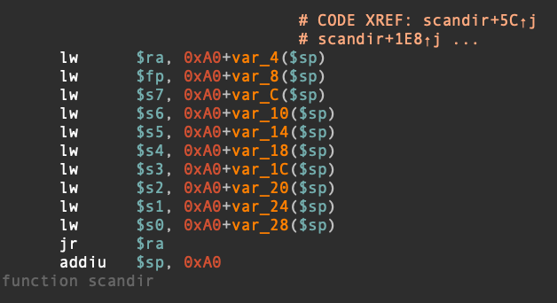

> xxxkkk@海特实验室

## 概述

因为 MIPS 指令集不同于 X86 指令集架构，所以在栈溢出的利用方式上有所差别，ROP 链的构造也不尽相同，这里概述一下关于 MIPS 栈溢出利用的技巧和特点。

## 常见寻找MIPS Gardget工具
* ROPgardget
最常见，最通用的全平台寻找Gardget工具

```
> ROPgadget --binary libc.so.6
......
0x00049298 : xori $v0, $v0, 2 ; sw $v0, 0x1c($sp) ; lw $t9, -0x6d14($gp) ; jalr $t9 ; addiu $a0, $sp, 0x20
0x000492f0 : xori $v0, $v0, 2 ; sw $v0, 8($s1) ; lw $v0, 0x38($sp) ; sw $v0, 4($s1) ; move $v0, $v1 ; lw $ra, 0x54($sp) ; lw $s2, 0x50($sp) ; lw $s1, 0x4c($sp) ; lw $s0, 0x48($sp) ; jr $ra ; addiu $sp, $sp, 0x58
0x000b03a4 : xori $v0, $v1, 0x1f ; movn $a3, $zero, $v0 ; addiu $a0, $zero, 4 ; lw $a1, -0x7fd8($gp) ; addiu $a1, $a1, 0x6c08 ; lw $a2, -0x7fd8($gp) ; lw $t9, -0x7940($gp) ; jalr $t9 ; addiu $a2, $a2, 0x6c40
0x00040708 : xori $v0, $v1, 1 ; addiu $v1, $zero, 1 ; xori $v0, $v1, 1 ; andi $v0, $v0, 0xff ; b 0x40780 ; andi $v1, $v0, 0xff ; move $a0, $a1 ; lw $t9, -0x6ebc($gp) ; jalr $t9 ; move $a1, $s1
0x00040710 : xori $v0, $v1, 1 ; andi $v0, $v0, 0xff ; b 0x40778 ; andi $v1, $v0, 0xff ; move $a0, $a1 ; lw $t9, -0x6ebc($gp) ; jalr $t9 ; move $a1, $s1
0x000d2dc4 : xori $v1, $a3, 8 ; lw $t9, -0x75f4($gp) ; jalr $t9 ; nop
0x000accbc : xori $v1, $fp, 1 ; addiu $a0, $zero, 0x1c ; addiu $v0, $zero, 2 ; movz $a0, $v0, $v1 ; lw $t9, -0x7fa4($gp) ; addiu $t9, $t9, -0x4748 ; jalr $t9 ; sw $a0, 0x44($sp)
0x000b941c : xori $v1, $v0, 1 ; addiu $v0, $zero, -1 ; movz $v0, $zero, $v1 ; lw $ra, 0x28($sp) ; jr $ra ; addiu $sp, $sp, 0x30
0x000b93ac : xori $v1, $v0, 1 ; addiu $v0, $zero, -1 ; movz $v0, $zero, $v1 ; lw $ra, 0x30($sp) ; jr $ra ; addiu $sp, $sp, 0x38

Unique gadgets found: 114925
```
优点：通用，各平台都能一键找，找特定地址的Gardget也还用
缺点：找MIPS的时候稍微需要一点特别的技巧

* MIPSROP (https://github.com/devttys0/ida/tree/master/plugins/mipsrop)

IDA里面的插件，专门针对MIPS


优点：针对性强，有很多选项能找满足ROP要求的特定的Gardget
缺点：其他架构不行（名字就叫MIPS）

## 常见Gardget分析
为了了解MIPS下栈溢出的利用，首先得对MIPS的传参约定有一个基本的了解。

MIPS有32个通用寄存器（$0-$31），各寄存器的功能及汇编程序中使用约定如下


其中比较重要的是$v0为函数返回值存放的寄存器，$ra存在返回地址，$a0-$a3存在函数的四个调用参数，当需要使用更多的寄存器时，就需要堆栈（stack)了,需要注意的是MIPS编译器总是为参数在堆栈中留有空间以防有参数需要存储。

因此对于使用ROP进行一般的函数操作来说，寄存器的四个参数已经足够了，因此控制这个四个寄存器对于ROP来说比较关键。

### 通用的 gadget 段

在uclibc库中，有几个比较关键的gadget，在`scandir`的尾部或者`scandir64`的尾部，从图上看基本上可以设置所有寄存器值，从s0-s7



有一条比较常规的ROP链，执行的整体流程为 sleep(1) -> read_value_from_stack -> jump to stack(shellcode)

### 利用流程

首先寻找一个设置a0为常量的Gardget，可以使用MIPSRop寻找设置a0寄存器的Gardget
```
Python>mipsrop.find("li $a0,")
----------------------------------------------------------------------------------------------------------------
|  Address     |  Action                                              |  Control Jump                          |
----------------------------------------------------------------------------------------------------------------
|  0x004608C0  |  li $a0,0xE10                                        |  jalr  $v0                             |
|  0x0042F5B0  |  li $a0,0xE                                          |  jr    0x28+var_8($sp)                 |
|  0x004314B8  |  li $a0,4                                            |  jr    0x20+var_8($sp)                 |
|  0x00437E90  |  li $a0,0xFFFFFFFF                                   |  jr    0x20+var_8($sp)                 |
|  0x00439F68  |  li $a0,8                                            |  jr    0x20+var_8($sp)                 |
----------------------------------------------------------------------------------------------------------------
Found 5 matching gadgets
```
其次，从内存加载数据到寄存器
```
LOAD:0001E20C                 move    $t9, $s1
LOAD:0001E210                 lw      $ra, 0x28+var_4($sp)
LOAD:0001E214                 lw      $s2, 0x28+var_8($sp)
LOAD:0001E218                 lw      $s1, 0x28+var_C($sp)
LOAD:0001E21C                 lw      $s0, 0x28+var_10($sp)
LOAD:0001E220                 jr      $t9
LOAD:0001E224                 addiu   $sp, 0x28
```
然后，把栈地址放到寄存器中
```
mipsrop.stackfinder()
----------------------------------------------------------------------------------------------------------------
|  Address     |  Action                                              |  Control Jump                          |
----------------------------------------------------------------------------------------------------------------
|  0x0041FF7C  |  addiu $s0,$sp,0xA10+var_9F0                         |  jalr  $s5                             |
|  0x00436D80  |  addiu $s2,$sp,0x448+var_430                         |  jalr  $s0                             |
|  0x00437B7C  |  addiu $s1,$sp,0x458+var_438                         |  jalr  $s0                             |
|  0x0043FE54  |  addiu $a1,$sp,0x478+var_448                         |  jalr  $s7                             |
|  0x00451B18  |  addiu $v0,$sp,0x88+var_78                           |  jalr  $v0                             |
|  0x00451B8C  |  addiu $v0,$sp,0x98+var_88                           |  jalr  $v0                             |
|  0x00451C00  |  addiu $v0,$sp,0xA8+var_98                           |  jalr  $v0                             |
|  0x004520D4  |  addiu $v0,$sp,0xB8+var_A8                           |  jalr  $v0                             |
|  0x0045215C  |  addiu $v0,$sp,0xB8+var_A8                           |  jalr  $v0                             |
|  0x004521D0  |  addiu $v0,$sp,0xD8+var_C8                           |  jalr  $v0                             |
|  0x00452240  |  addiu $v0,$sp,0xD8+var_C8                           |  jalr  $v0                             |
|  0x004522B0  |  addiu $v0,$sp,0xB8+var_A8                           |  jalr  $v0                             |
|  0x00452340  |  addiu $v0,$sp,0xB8+var_A8                           |  jalr  $v0                             |
|  0x004523CC  |  addiu $v0,$sp,0xB8+var_A8                           |  jalr  $v0                             |
|  0x004529C4  |  addiu $v0,$sp,0x918+var_900                         |  jalr  $v0                             |
|  0x00452A44  |  addiu $v0,$sp,0x928+var_910                         |  jalr  $v0                             |
|  0x00452AB8  |  addiu $v0,$sp,0x938+src                             |  jalr  $v0                             |
|  0x00452B48  |  addiu $v0,$sp,0x948+var_930                         |  jalr  $v0                             |
|  0x00452BBC  |  addiu $v0,$sp,0x968+var_950                         |  jalr  $v0                             |
|  0x00452C2C  |  addiu $v0,$sp,0x968+var_950                         |  jalr  $v0                             |
|  0x00452C9C  |  addiu $v0,$sp,0x948+var_930                         |  jalr  $v0                             |
|  0x00452D1C  |  addiu $v0,$sp,0x948+var_930                         |  jalr  $v0                             |
|  0x00452DAC  |  addiu $v0,$sp,0x948+var_930                         |  jalr  $v0                             |
|  0x00452E38  |  addiu $v0,$sp,0x948+var_930                         |  jalr  $v0                             |
|  0x004559D4  |  addiu $v0,$sp,0x278+var_268                         |  jalr  $v0                             |
|  0x00455A3C  |  addiu $v0,$sp,0x288+var_278                         |  jalr  $v0                             |
|  0x00455AD0  |  addiu $v0,$sp,0x288+var_278                         |  jalr  $v0                             |
|  0x00455B48  |  addiu $v0,$sp,0x298+var_288                         |  jalr  $v0                             |
|  0x00455BC8  |  addiu $v0,$sp,0x298+var_288                         |  jalr  $v0                             |
|  0x00455C58  |  addiu $v0,$sp,0x298+var_288                         |  jalr  $v0                             |
|  0x00455D0C  |  addiu $v0,$sp,0x298+var_288                         |  jalr  $v0                             |
|  0x00414E6C  |  addiu $a0,$sp,0x138+arg_0                           |  jr    0x138+var_4($sp)                |
|  0x00416584  |  addiu $a0,$sp,0x340+var_328                         |  jr    0x340+var_8($sp)                |
|  0x00416680  |  addiu $a0,$sp,0x340+var_328                         |  jr    0x340+var_8($sp)                |
|  0x0041677C  |  addiu $a0,$sp,0x340+var_328                         |  jr    0x340+var_8($sp)                |
|  0x00416878  |  addiu $a0,$sp,0x340+var_328                         |  jr    0x340+var_8($sp)                |
|  0x004169AC  |  addiu $a0,$sp,0x348+var_330                         |  jr    0x348+var_8($sp)                |
|  0x00417728  |  addiu $a0,$sp,0x138+var_11C                         |  jr    0x138+var_4($sp)                |
|  0x0041C928  |  addiu $a1,$sp,0x28+var_10                           |  jr    0x28+var_8($sp)                 |
|  0x0042C3B8  |  addiu $a0,$sp,0xB0+var_48                           |  jr    0xB0+var_4($sp)                 |
|  0x00438C3C  |  addiu $a2,$sp,0x428+var_410                         |  jr    0x428+var_8($sp)                |
|  0x0043FB8C  |  addiu $a0,$sp,0x50+var_30                           |  jr    0x50+var_8($sp)                 |
|  0x004403DC  |  addiu $a0,$sp,0x850+var_830                         |  jr    0x850+var_8($sp)                |
----------------------------------------------------------------------------------------------------------------
Found 43 matching gadgets
```
最后跳到shellcode中
```
mipsrop.find("move $t9, $s2")
----------------------------------------------------------------------------------------------------------------
|  Address     |  Action                                              |  Control Jump                          |
----------------------------------------------------------------------------------------------------------------
|  0x0001C890  |  move $t9,$s2                                        |  jalr  $s2                             |
|  0x0001C8AC  |  move $t9,$s2                                        |  jalr  $s2                             |
|  0x0001C8E0  |  move $t9,$s2                                        |  jalr  $s2                             |
|  0x0001C914  |  move $t9,$s2                                        |  jalr  $s2                             |
|  0x0001CB40  |  move $t9,$s2                                        |  jalr  $s2                             |
|  0x0001DC58  |  move $t9,$s2                                        |  jalr  $s2                             |
|  0x0001DC6C  |  move $t9,$s2                                        |  jalr  $s2                             |
|  0x0002A89C  |  move $t9,$s2                                        |  jalr  $s2                             |
|  0x0002A8B4  |  move $t9,$s2                                        |  jalr  $s2                             |
|  0x00043398  |  move $t9,$s2                                        |  jalr  $s2                             |
|  0x00047458  |  move $t9,$s2                                        |  jalr  $s2                             |
|  0x00047474  |  move $t9,$s2                                        |  jalr  $s2                             |
|  0x00053110  |  move $t9,$s2                                        |  jalr  $s2                             |
|  0x00053648  |  move $t9,$s2                                        |  jalr  $s2                             |
|  0x0005371C  |  move $t9,$s2                                        |  jalr  $s2                             |
|  0x000556A8  |  move $t9,$s2                                        |  jalr  $s2                             |
|  0x000556CC  |  move $t9,$s2                                        |  jalr  $s2                             |
|  0x00055768  |  move $t9,$s2                                        |  jalr  $s2                             |
|  0x0005578C  |  move $t9,$s2                                        |  jalr  $s2                             |
|  0x0005674C  |  move $t9,$s2                                        |  jalr  $s2                             |
|  0x00056770  |  move $t9,$s2                                        |  jalr  $s2                             |
|  0x0005680C  |  move $t9,$s2                                        |  jalr  $s2                             |
|  0x00056830  |  move $t9,$s2                                        |  jalr  $s2                             |
|  0x00057B24  |  move $t9,$s2                                        |  jalr  $s2                             |
|  0x000580C4  |  move $t9,$s2                                        |  jalr  $s2                             |
|  0x00058E9C  |  move $t9,$s2                                        |  jalr  $s2                             |
|  0x00058EC0  |  move $t9,$s2                                        |  jalr  $s2                             |
|  0x00058F5C  |  move $t9,$s2                                        |  jalr  $s2                             |
|  0x00058F80  |  move $t9,$s2                                        |  jalr  $s2                             |
|  0x0005A064  |  move $t9,$s2                                        |  jalr  $s2                             |
|  0x0005A4C0  |  move $t9,$s2                                        |  jalr  $s2                             |
|  0x0005AA4C  |  move $t9,$s2                                        |  jalr  $s2                             |
|  0x0005AF30  |  move $t9,$s2                                        |  jalr  $s2                             |
|  0x0005BD14  |  move $t9,$s2                                        |  jalr  $s2                             |
|  0x0005BD40  |  move $t9,$s2                                        |  jalr  $s2                             |
|  0x0005D4AC  |  move $t9,$s2                                        |  jalr  $s2                             |
|  0x0005D4F0  |  move $t9,$s2                                        |  jalr  $s2                             |
|  0x0005DDCC  |  move $t9,$s2                                        |  jalr  $s2                             |
|  0x0005DDF8  |  move $t9,$s2                                        |  jalr  $s2                             |
|  0x0005E37C  |  move $t9,$s2                                        |  jalr  $s2                             |
|  0x0006052C  |  move $t9,$s2                                        |  jalr  $s2                             |
|  0x00060548  |  move $t9,$s2                                        |  jalr  $s2                             |
|  0x00060564  |  move $t9,$s2                                        |  jalr  $s2                             |
|  0x00062888  |  move $t9,$s2                                        |  jalr  $s2                             |
|  0x0006D8F8  |  move $t9,$s2                                        |  jalr  $s2                             |
|  0x000765E4  |  move $t9,$s2                                        |  jalr  $s2                             |
|  0x000766B0  |  move $t9,$s2                                        |  jalr  $s2                             |
|  0x00078720  |  move $t9,$s2                                        |  jalr  $s2                             |
|  0x0007A23C  |  move $t9,$s2                                        |  jalr  $s2                             |
|  0x0007A2C4  |  move $t9,$s2                                        |  jalr  $s2                             |
|  0x0008EE68  |  move $t9,$s2                                        |  jalr  $s2                             |
|  0x0008F30C  |  move $t9,$s2                                        |  jalr  $s2                             |
|  0x0009453C  |  move $t9,$s2                                        |  jalr  $s2                             |
|  0x0009457C  |  move $t9,$s2                                        |  jalr  $s2                             |
|  0x00098264  |  move $t9,$s2                                        |  jalr  $s2                             |
|  0x000AF9E8  |  move $t9,$s2                                        |  jalr  $s2                             |
|  0x000B088C  |  move $t9,$s2                                        |  jalr  $s2                             |
|  0x000B4148  |  move $t9,$s2                                        |  jalr  $s2                             |
|  0x000B46BC  |  move $t9,$s2                                        |  jalr  $s2                             |
|  0x000B471C  |  move $t9,$s2                                        |  jalr  $s2                             |
|  0x000BCF18  |  move $t9,$s2                                        |  jalr  $s2                             |
|  0x000BCFF0  |  move $t9,$s2                                        |  jalr  $s2                             |
|  0x000BD01C  |  move $t9,$s2                                        |  jalr  $s2                             |
|  0x000DB248  |  move $t9,$s2                                        |  jalr  $s2                             |
|  0x000DB3F4  |  move $t9,$s2                                        |  jalr  $s2                             |
|  0x000DB4C8  |  move $t9,$s2                                        |  jalr  $s2                             |
|  0x000DB6DC  |  move $t9,$s2                                        |  jalr  $s2                             |
|  0x000DB838  |  move $t9,$s2                                        |  jalr  $s2                             |
|  0x000DBA34  |  move $t9,$s2                                        |  jalr  $s2                             |
|  0x000DBC24  |  move $t9,$s2                                        |  jalr  $s2                             |
|  0x000DBDE8  |  move $t9,$s2                                        |  jalr  $s2                             |
|  0x000DBF74  |  move $t9,$s2                                        |  jalr  $s2                             |
|  0x000E5D88  |  move $t9,$s2                                        |  jalr  $s2                             |
|  0x000E5DA0  |  move $t9,$s2                                        |  jalr  $s2                             |
----------------------------------------------------------------------------------------------------------------
```
这个链是相对来说最通用的一个链，由于MIPS的特性，对于需要Sleep中断一下，才可以直接跳到stack中的shellcode，但是要求nx没开，libc的地址也是知道的，通过实战编写发现HTTP包中发出的shellcode容易被各种奇怪的字符截断，可以进行绕过但是比较繁琐。
因此还有另外一种链，个人感觉比较好用，其实很简单，就是system(cmd)
用RopGardget搜```ROPgadget --binary libc.so.6 | grep "move \$t9, \$s"```，可以看到类似这些的gardget
```
move $t9, $s0 ; jalr $t9 ; addiu $a0, $sp, 0x38
```

```
move $t9, $s0 ; jalr $t9 ; addiu $a0, $sp, 0x34
```
或者这样的
```
 move $t9, $s1 ; jalr $t9 ; move $a0, $s0
```
第一类用之前说的scandir那边的gardget设置好s0就直接可以跳system了，命令放栈上即可
第二类稍微复杂一些，再找一个``` addiu $s0, $sp, 0x94 ;```即可
还有比较好的是类似这样的：
```
addiu $s0, $sp, 0x94 ; lw $t9, -0x7718($gp) ; jalr $t9 ; move $a0, $s0
```

- 但是个人推荐使用前一种通过执行 shellcode 来反弹 shell 的方式，MIPS 指令集无法开启 NX，所以使用这种方式比较方便。使用第二种执行 system 命令，如 `sysetm("telentd -p 123 -l /bin/sh")` 的方法，可能因为参数控制不好的原因出现各种各样的问题。

## 关于调用 sleep 函数的原因

因为 MIPS 流水线指令集的特点，存在 cache incoherency 的特性，需要手动调用 sleep 函数，将数据区刷新到指令区当中去，从而可以正常执行 shellcode。如下图：


## 参考文章

[exploiting buffer overflows on mips architectures](https://www.vantagepoint.sg/papers/MIPS-BOF-LyonYang-PUBLIC-FINAL.pdf "exploiting buffer overflows on mips architectures")
