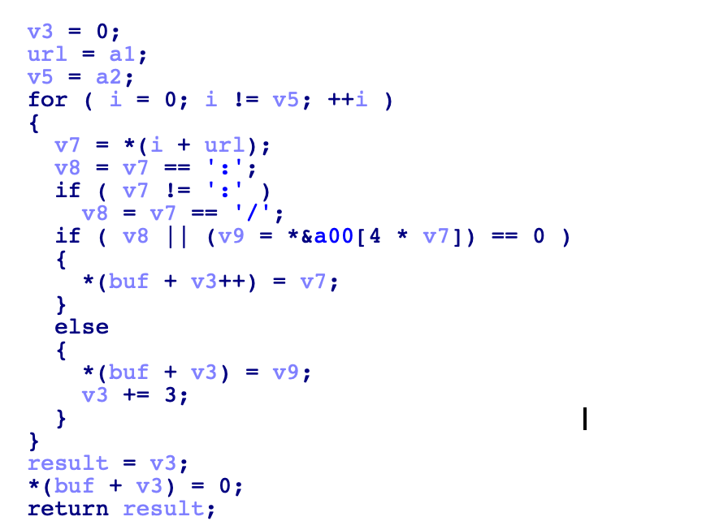
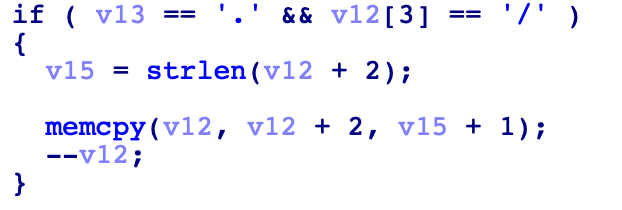

## C 语言中字符分割有关的函数与常见字符串复制溢出点

### **strpbrk 搜索字符（任一字符）**

函数原型：

```
char *strpbrk(const char *s, const char *accept);
```

例子：

- 返回匹配到任意一个字符串的起始位置，常用于匹配过滤非法字符。

```
char *s1="Welcome To Beijing";
char *s2="lco";
// char *s2 = "lbo"; /*Output "lcome To Beijing"*/

char *p;

p=strpbrk(s1,s2);

printf("%s\n",p); /*Output "lcome To Beijing"*/
```

### **strstr（完整匹配字符串）**

函数原型：

```
char *strstr(const char *haystack, const char *needle);
```

例子：

- 返回匹配完整字符串的位置，如果没有匹配到完整字符串，就返回为空。

```
char *s1="Welcome To Beijing";
char *s2="lco";
// char *s2 = "lbo"; /*Output NULL*/

char *p;

p=strstr(s1,s2);

printf("%s\n",p); /*Output "lcome To Beijing"*/
```

### **strcasestr（完整匹配字符串）**

函数原型：

```
char *strstr(const char *haystack, const char *needle);
```

例子：

```
int main(){

char *s1="Welcome To Beijing";
char *s2="lco";
char *p;

p=strcasestr(s1,s2);

printf("%s\n",p); /*Output "lcome To Beijing"*/
}

```

### **strchr**

函数原型：

```
char *strchr(const char *s, int c);
```

例子：

```
#include <stdio.h>
#include <stdlib.h>

int main(){

char *s1="Welcome To Beijing";

char *p;

p=strchr(s1,'T');

printf("%s\n",p); /*Output "To Beijing"*/

}
```

### **strsep 函数**

函数原型：

```
char *strsep(char **stringp, const char *delim);
```

例子：

```
int main(){

    char s1[]={"Welcome To Beijing"};
    char *s2="c";
    char *p;
    char *tmp;
    tmp = s1;

    p = strsep(&tmp,s2);
    printf("%s\n",p);   /* Output "Wel" */


    printf("%s\n",tmp); /* Output "ome To Beijing" */
    return 0;
}
```

### **strok** 函数

函数原型：

```
char *strtok(char s[], const char *delim);
```

例子：

```
int main(){

    char s1[] = "Welcome To Beijing";
    const char *s2 = "c";
    char *p;

    p = strtok(s1,s2);
    printf("%s\n",p);								/* Output "Wel" */


    printf("%s\n",strtok(NULL,s2));	/* Output "ome To Beijing" */
}
```

- `strtok`函数的第二个参数为 NULL 时，会分割后向的字符串。


## 容易出现栈溢出的函数/函组合

### 空指针异常

很多字符串匹配函数没有考虑返回值为空的情况，就直接将空指针拿来引用，如：

1. strdup

   ```
   host = getenv("HTTP_HOST");	
   // if(host == NULL){exit(1)}
   result = strdup(host);
   ```

   在这种情况下，host 是在 http 请求包中，并且是由我们可控的，如果我们不给 host 头字段赋值的话，`getenv `函数就返回空指针，在调用`strdup`函数时没有判断参数导致的空指针异常。

2. strstr

   ```
   referer = getenv("HTTP_REFERER");	
   loc = strstr("http://",referer);
   // if(loc == NULL){exit(1);}
   result = strdup(loc);
   ```

   ​	同理，http 包中的 referer 字段也是我们可控的，如果我们手动去掉 referer 字段的值，就会导致 loc 为空指针，下一步没有判断参数是否为空，导致的空指针异常。

### 函数使用不当导致溢出

1. snprintf

   ```
   int len = snprintf(buf1,0x20,"%s",getenv("HTTP_REFERER"));
   memcpy(buf2,buf,len);
   ```

   因为 `snprintf` 函数的返回值是格式化字符串内容的长度，而不是 buf1 的长度，所以 len 的大小是由我们控制的，如果在下方继续使用了这个 len 变量作为 `memcpy`的第三个参数的话，就很有可能造成溢出。

2. strchr

   ```
   char *url = getenv("QUERY_STRING");
   char *query = strchr(url, '?');
   strncpy(stack, url, query - url -1);
   ```

   query 指针指向 `strchr`函数的 url 的 "?" 字符的位置，url 为我们可控的 url 字符串，如果我们输入类似 `test.com///////////////////?`则会导致 `query - url -1`的值超大，作为`strncpy`的第三个参数时，很有可能造成溢出。

3. 待补充...

### 数组越界

举个例子，下面的代码中，url 变量是我们可控的，buf 是一个大小为 0x20 的栈空间，而这里没有对 url 的长度做限制，导致可以无限制的复制 url 的内容到 buf 中，最终导致栈溢出。

如这里，我们可以输入`http://:::::::::::::::::::::`，从而进入 if 分支，将 url 的字符逐个复制进 buf：



再举一个例子，在这里输入的字符串指针 v12+2 是由我们控制的，而 v12 是一个有限的栈空间内存，我们可以无限制的输入，使用 `memcpy`函数复制到 v12 的栈空间中，从而导致栈溢出。


