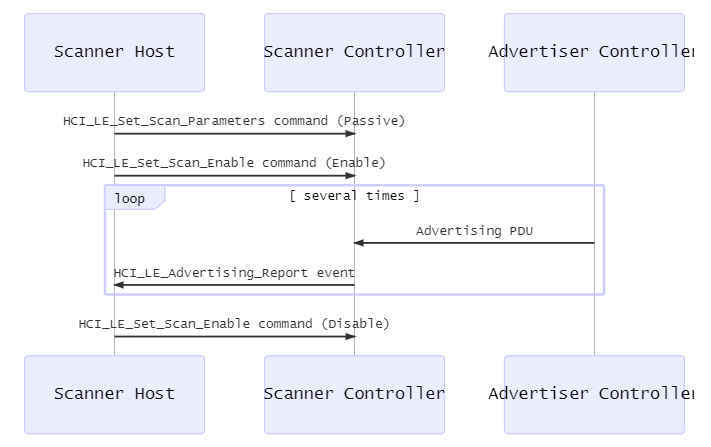

> Sourcell@海特实验室

BLE (Bluetooth Low Energy) 设备可以通过扫描发现周围的其他 BLE 设备。当 BLE 设备执行扫描时便处在 scanning state。该状态是 BLE 设备在 LL (Link Layer) 的状态之一。它与其他几种 LL 状态构成了如下状态机：


处于 scanning state 的 BLE 设备被称为 scanner。对应的，当 BLE 设备想让其他设备发现自己时会处在 advertising state。此时 BLE 设备被称为 advertiser。

## Scanning Type

BLE 设备主要可执行两种扫描 active scanning 和 passive scanning（更复杂的扫描情况可参考 ref 2）。具体使用何种扫描方式由 `HCI_LE_Set_Scan_Parameters` command 控制。该命令中有一个 `LE_Scan_Type` 参数，当设为 0x00 时执行 passive scanning：

```txt
Bluetooth HCI Command - LE Set Scan Parameters
    Command Opcode: LE Set Scan Parameters (0x200b)
    Parameter Total Length: 7
    Scan Type: Passive (0x00)
    Scan Interval: 16 (10 msec)
    Scan Window: 16 (10 msec)
    Own Address Type: Public Device Address (0x00)
    Scan Filter Policy: Accept all advertisements, except directed advertisements not addressed to this device (0x00)
```

当设为 0x01 时执行 active scanning：

```txt
Bluetooth HCI Command - LE Set Scan Parameters
    Command Opcode: LE Set Scan Parameters (0x200b)
    Parameter Total Length: 7
    Scan Type: Active (0x01)
    Scan Interval: 16 (10 msec)
    Scan Window: 16 (10 msec)
    Own Address Type: Public Device Address (0x00)
    Scan Filter Policy: Accept all advertisements, except directed advertisements not addressed to this device (0x00)
    [Response in frame: 2]
    [Command-Response Delta: 1.784ms]

```

其他的值目前均被保留。`HCI_LE_Set_Scan_Parameters` command 只是配置了扫描的参数，要真正开始扫描还需要发送 `HCI_LE_Set_Scan_Enable` command：

```txt
Bluetooth HCI Command - LE Set Scan Enable
    Command Opcode: LE Set Scan Enable (0x200c)
    Parameter Total Length: 2
    Scan Enable: true (0x01)
    Filter Duplicates: true (0x01)
```

Passive scanning 的数据流如下[3]：



Active scanning 的数据流如下[4]：


## Active Scanning 与 Passive Scanning 的隐蔽性

对于 passive scanning，它仅在 LL 上安静地接收空中飘过的各种 advertising PDUs，绝不会主动发送其他数据。因此 passive scanning 很隐蔽，不会暴露 scanner 的任何信息。

对于 active scanning，它除了像 passive scanning 一样接收空中的 advertising PDUs，还会主动向 advertiser 发送 `SCAN_REQ` PDU，然后接收 advertiser 响应的 `SCAN_RSP` PDU，从而获取 advertiser 更多的信息：


不过 `SCAN_REQ` PDU 会携带 scanner 的 address，即上图中的 `ScanA` 字段。这可能会暴露 scanner 的身份。因此在执行 active scanning 时，我们最好使用 `spooftooph` 伪造自己的 BD_ADDR，防止真实 BD_ADDR 被暴露。

## 解析扫描结果

不论是 active scanning 还是 passive scanning，扫描的结果均以 `HCI_LE_Advertising_Report` event 的形式返回给 host。该 event 携带的 `Event_Type` parameter 有如下 5 种取值[5]，说明了扫描结果来自于哪一种 advertising PDU：

| Value            | Description           |
| :--------------- | :-------------------- |
| 0x00             | `ADV_IND` PDU         |
| 0x01             | `ADV_DIRECT_IND` PDU  |
| 0x02             | `ADV_SCAN_IND` PDU    |
| 0x03             | `ADV_NONCONN_IND` PDU |
| 0x04             | `SCAN_RSP` PDU        |
| All other values | RFU                   |

对于返回的结果，passive scanning 与 active scanning 的区别体现在 `SCAN_RSP` PDU 上。Active scanning 有能力返回 `SCAN_RSP` PDU，而 passive scanning 不可能返回 `SCAN_RSP` PDU。

具体扫描得到的数据存储在 `Data` 参数中。该参数也有协议定义的格式，简单的说它是一个 AD (Advertising Data) structure 数组。AD structure 的格式如下[6]：

```txt
+--------+-------------------+
| Length | Data              |
+--------+-------------------+
         | AD Type | AD Data |
         +-------------------+
```

其中 AD Type 的含义由 [GAP (Generic Access Profile)](https://www.bluetooth.com/specifications/assigned-numbers/generic-access-profile) 定义。

这里举两个例子。比如 passive scanning 返回的扫描结果如下：

```txt
Bluetooth HCI Event - LE Meta
    Event Code: LE Meta (0x3e)
    Parameter Total Length: 30
    Sub Event: LE Advertising Report (0x02)
    Num Reports: 1
    Event Type: Connectable Undirected Advertising (0x00)
    Peer Address Type: Public Device Address (0x00)
    BD_ADDR: Espressi_9c:07:06 (24:0a:c4:9c:07:06)
    Data Length: 18
    Advertising Data
        Flags
            Length: 2
            Type: Flags (0x01)
            1.   .... = Reserved: 0x0
            ...0 .... = Simultaneous LE and BR/EDR to Same Device Capable (Host): false (0x0)
            .... 0... = Simultaneous LE and BR/EDR to Same Device Capable (Controller): false (0x0)
            .... .1.. = BR/EDR Not Supported: true (0x1)
            .... ..1. = LE General Discoverable Mode: true (0x1)
            .... ...0 = LE Limited Discoverable Mode: false (0x0)
        Tx Power Level
            Length: 2
            Type: Tx Power Level (0x0a)
            Power Level (dBm): -21
        16-bit Service Class UUIDs
            Length: 3
            Type: 16-bit Service Class UUIDs (0x03)
            UUID 16: Unknown (0x00ff)
        Device Name: BLECTF
            Length: 7
            Type: Device Name (0x09)
            Device Name: BLECTF
    RSSI: -65dBm

```

再比如 Active scanning 因 `SCAN_RSP` PDU 返回扫描结果如下：

```txt
Bluetooth HCI Event - LE Meta
    Event Code: LE Meta (0x3e)
    Parameter Total Length: 22
    Sub Event: LE Advertising Report (0x02)
    Num Reports: 1
    Event Type: Scan Response (0x04)
    Peer Address Type: Public Device Address (0x00)
    BD_ADDR: Espressi_9c:07:06 (24:0a:c4:9c:07:06)
    Data Length: 10
    Advertising Data
        Flags
            Length: 2
            Type: Flags (0x01)
            1.   .... = Reserved: 0x0
            ...0 .... = Simultaneous LE and BR/EDR to Same Device Capable (Host): false (0x0)
            .... 0... = Simultaneous LE and BR/EDR to Same Device Capable (Controller): false (0x0)
            .... .1.. = BR/EDR Not Supported: true (0x1)
            .... ..1. = LE General Discoverable Mode: true (0x1)
            .... ...0 = LE Limited Discoverable Mode: false (0x0)
        Tx Power Level
            Length: 2
            Type: Tx Power Level (0x0a)
            Power Level (dBm): -21
        16-bit Service Class UUIDs
            Length: 3
            Type: 16-bit Service Class UUIDs (0x03)
            UUID 16: Unknown (0x00ff)
    RSSI: -68dBm
```

## 实战中 Active Scanning 不一定比 Passive Scanning 更有效

在情报收集阶段，我们很关心目标设备的名字。但是厂商给出设备名称的位置是不确定的。设备名称可能位于 advertising data 也可能位于 scan response data。因此有时使用 passive scanning 也能获取目标设备的名字。

另外，厂商不一定使用 GAP 定义的 AD Type 0x09 (Complete Local Name) 来存储设备的名字。因为 GAP 还定义了 AD Type 0xFF (Manufacturer Specific Data)，厂商也可能把设备的名字放在其中并定义自己的解析规则。

因此在无法伪装 BD_ADDR 时，可以直接试试 passive scanning 能否解决问题。

## References

1. BLUETOOTH CORE SPECIFICATION Version 5.2 | Vol 6, Part B page 2857, Figure 1.1: State diagram of the Link Layer state machine
2. BLUETOOTH CORE SPECIFICATION Version 5.2 | Vol 6, Part D page 3114, 4 SCANNING STATE
3. BLUETOOTH CORE SPECIFICATION Version 5.2 | Vol 6, Part D page 3114, 4.1 PASSIVE SCANNING
4. BLUETOOTH CORE SPECIFICATION Version 5.2 | Vol 6, Part D page 3115, 4.2 ACTIVE SCANNING
5. BLUETOOTH CORE SPECIFICATION Version 5.2 | Vol 4, Part E page 2382, 7.7.65.2 LE Advertising Report event
6. BLUETOOTH CORE SPECIFICATION Version 5.2 | Vol 3, Part C page 1392, BLUETOOTH CORE SPECIFICATION Version 5.2 | Vol 3, Part C page 1392
7. [Assigned numbers and GAP](https://www.bluetooth.com/specifications/assigned-numbers/generic-access-profile/)

