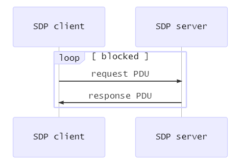
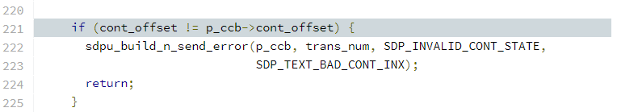
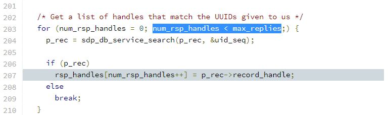

> Sourcell@海特实验室

[CVE-2017-0785](http://cve.mitre.org/cgi-bin/cvename.cgi?name=CVE-2017-0785) 属于 BlueBorne 漏洞集。导致该漏洞的原因是 Android BlueDroid 和 Fluoride 蓝牙协议栈实现的 SDP server 没有正确处理 continuation state。攻击者可以利用它泄露 Android 栈上的内存信息，然后绕过 ASLR。

本文将基于标签为 [android-8.0.0_r1](https://android.googlesource.com/platform/system/bt/+/refs/tags/android-8.0.0_r1) 的 AOSP Fluoride 蓝牙协议栈分析该漏洞。

## 背景知识

### SDP 简介

SDP (Service Discovery Protocol) 是经典蓝牙中的高层协议，使用 C/S 架构。它定义了 client 如何发现 server 提供的服务：



上图中的关键点是，client 必须等待 server 响应当前的 request PDU 后，才能发送下一个 request PDU。Request PDU 会携带限制 response PDU 返回数据大小的字段，比如 `MaximumAttributeByteCount`：

```txt
Bluetooth SDP Protocol
    PDU: Service Search Attribute Request (0x06)
    Transaction Id: 0x0000
    Parameter Length: 15
    Service Search Pattern: Public Browse Group
    Maximum Attribute Byte Count: 65535
    Attribute ID List
    Continuation State: no (00)
```

Response PDU 也会携带相应的字段表示自己返回数据的长度，比如 `AttributeListsByteCount`：

```txt
Bluetooth SDP Protocol
    PDU: Service Search Attribute Response (0x07)
    Transaction Id: 0x0000
    Parameter Length: 667
    Attribute List Byte Count: 662
    Data Fragment
    Continuation State: yes (02 96)
        Continuation State Length: 2
        Continuation State Value
```

### Continuation State 简介

上一节提到的 `AttributeListsByteCount` 不能比 `MaximumAttributeByteCount` 大。一旦 server 发现 client 请求的数据在一个 response PDU 中放不下，就会把数据分段，并使用 SDP 定义的 continuation state 完成所有分段的传输。每个数据段的大小不一定把 `MaximumAttributeByteCount` 用完，server 可自行决定分段大小。比如在上面的 response PDU 中分段大小为 662 字节，远小于 `MaximumAttributeByteCount` 定义的最大值 65535。

传输分段数据的 response PDU 必须携带 `ContinuationState` 字段。该字段由两部分组成。其中 `InfoLength` 表示 continuation information 的长度，且最大值为 0x10：

```txt
+------------+--------------------------+
| InfoLength | Continuation Information |
+------------+--------------------------+
```

Continuation information 则是一个很神奇的字段，因为蓝牙核心规范并没有为它定义具体的含义，只要求该字段能解决分段传输的问题即可。具体的情形是，client 收到携带分段数据的 response PDU 后，会把其中的 `ContinuationState` 拿出来，放到下一个 request PDU 中发回给 server。然后 server 根据收到的 `ContinuationState` 确定下一个应传输的数据分段（这与 cookie 有异曲同工之妙），如此往复直到所有分段都传输完毕（传输最后一个分段的 response PDU 不使能 continuation state）。

### L2CAP 导致的数据分段

在大多数实际场景中，并不是上一节阐述的原因导致了数据分段。比如当 SDP server 返回的数据总和 (1343 bytes) 远小于 `MaximumAttributeByteCount` 设置的 65535 时，也会有数据分段：


这是因为 L2CAP (Logical Link Control and Adaptation Protocol) 的限制。L2CAP 承载了 SDP PDU 的传输，在 L2CAP 连接建立后，两端的设备会交换各自接收数据时支持的 MTU (Maximum Transmission Unit)：

```txt
Device A -> Device B
Bluetooth L2CAP Protocol
    Length: 12
    CID: L2CAP Signaling Channel (0x0001)
    Command: Configure Request
        Command Code: Configure Request (0x04)
        Command Identifier: 0x04
        Command Length: 8
        Destination CID: Dynamically Allocated Channel (0x0040)
        0000 0000 0000 000. = Reserved: 0x0000
        .... .... .... ...0 = Continuation Flag: False
        Option: MTU
            Type: Maximum Transmission Unit (0x01)
            Length: 2
            MTU: 1024

Device B -> Device A
Bluetooth L2CAP Protocol
    Length: 14
    CID: L2CAP Signaling Channel (0x0001)
    Command: Configure Response
        Command Code: Configure Response (0x05)
        Command Identifier: 0x04
        Command Length: 10
        Source CID: Dynamically Allocated Channel (0x0040)
        0000 0000 0000 000. = Reserved: 0x0000
        .... .... .... ...0 = Continuation Flag: False
        Result: Success (0x0000)
        Option: MTU
            Type: Maximum Transmission Unit (0x01)
            Length: 2
            MTU: 1024
```

当 SDP server 发现填入 SDP response PDU 的数据长度超过远端设备 L2CAP 设置的 MTU 时，就会使能 continuation state 把数据分段传输。

## Android 定义的 Continuation Information

前面说明了蓝牙核心规范并没有定义 continuation information 的具体含义是什么，于是 Android 对该字段的定义如下：

> [platform/system/bt/stack/sdp/sdpint.h#200](https://android.googlesource.com/platform/system/bt/+/refs/tags/android-8.0.0_r1/stack/sdp/sdpint.h#200)


`cont_offset` 的具体含义有两种：

* 当使用 `SDP_SERVICE_SEARCH_REQ/RSP` PDU 时，`cont_offset` 表示下一个分段中起始数据项相对不分段完整数据项的偏移。

  这里的数据项具体指的是 service record handle。比如 server 总共要返回 100 个 service record handle，第一次返回了 10 个，那么 `cont_offset` 就为 10。也可以把这个偏移理解为当前已经传输的数据项总和或是后续传输的第一个数据项在完整数据项中的索引。

* 当使用 `SDP_SERVICE_ATTR_REQ/RSP` 或 `SDP_SERVICE_SEARCH_ATTR_REQ/RSP` 时，`cont_offset` 表示下一个分段的数据相对不分段完整数据的偏移。

  这和上面一种情况类似，只不过 offset 的单位由一条数据项变为了字节。当然也可以理解为已经传输的分段数据大小总和。比如下面传输第一个分段数据的 response PDU，其中 `cont_offset` 为 `02 96`，即 662，正好等于 `AttributeListsByteCount` 中的 662。

  

Client 只要在后续的 request PDU 中回传 `cont_offset`，server 就能找到对应 response PDU 应携带分段数据的起始位置，从而继续传输分段数据。这满足了蓝牙核心规范解决分段传输问题的要求。

## 漏洞分析

Android 实现的 SDP server 在处理 request PDU 时会进入 `sdp_server_handle_client_req()`：

> [platform/system/bt/stack/sdp/sdp_server.cc#116](https://android.googlesource.com/platform/system/bt/+/refs/tags/android-8.0.0_r1/stack/sdp/sdp_server.cc#116)


该函数会根据 PDU ID 判断当前 request PDU 的类型。当 request PDU 为 `SDP_SERVICE_SEARCH_REQ` PDU 时，进入 `process_service_search()` 做进一步处理：

> [platform/system/bt/stack/sdp/sdp_server.cc#141](https://android.googlesource.com/platform/system/bt/+/refs/tags/android-8.0.0_r1/stack/sdp/sdp_server.cc#141)


处理函数会依次提取 `SDP_SERVICE_SEARCH_REQ` PDU 携带的三个参数：

1. 提取 `ServiceSearchPattern` 至 `uid_seq`

   > [platform/system/bt/stack/sdp/sdp_server.cc#183](https://android.googlesource.com/platform/system/bt/+/refs/tags/android-8.0.0_r1/stack/sdp/sdp_server.cc#183)

   

2. 提取 `MaximumServiceRecordCount` 至 `max_replies`

   > [platform/system/bt/stack/sdp/sdp_server.cc#192](https://android.googlesource.com/platform/system/bt/+/refs/tags/android-8.0.0_r1/stack/sdp/sdp_server.cc#192)


   

3. 提取 `ContinuationState` 至 `cont_offset`

   > [platform/system/bt/stack/sdp/sdp_server.cc#219](https://android.googlesource.com/platform/system/bt/+/refs/tags/android-8.0.0_r1/stack/sdp/sdp_server.cc#219)


   

   若当前处理的 request PDU 使能了 continuation state，SDP server 就会提取其中的 continuation information 字段，并存入 `cont_offset`。紧接着 Android 还会对 `cont_offset` 做安全检查，比较它与先前传给 SDP client 的值是否相等，防止攻击者恶意设置 offset 导致数组越界：

   > [platform/system/bt/stack/sdp/sdp_server.cc#221](https://android.googlesource.com/platform/system/bt/+/refs/tags/android-8.0.0_r1/stack/sdp/sdp_server.cc#221)


   

在得到 `uid_seq` 与 `max_replies` 后，SDP server 会找到所有与 `uid_seq` 匹配的 service record handle，并把它们存储在 `rsp_handles` 数组中。这些 handle 就是 client 请求的数据。`max_replies` 则用于限制这些 handle 的总数 `num_rsp_handles`（**漏洞点**），避免返回的 handle 数量超过 `MaximumServiceRecordCount` 的限制：

> [platform/system/bt/stack/sdp/sdp_server.cc#207](https://android.googlesource.com/platform/system/bt/+/refs/tags/android-8.0.0_r1/stack/sdp/sdp_server.cc#207)



对于每一个请求，`num_rsp_handles` 都会被重新计算一次。这种做法对不使用 continuation state 的请求是合理的，因为若 `uid_seq` 和 `max_replies` 不同，`num_rsp_handles` 也可能不同。但是当请求使用 continuation state 时，所有上下文相同的请求都应使用同样的 `uid_seq` 和 `max_replies`，那么 `num_rsp_handles` 不会改变，因此没必要再重新计算。如果重新计算，就应检查每次计算得到的 `num_rsp_handles` 是否相同。若不相同，则说明出现了异常流量，需要报错处理。但 AOSP 并没有做这种检查。

于是攻击者可以利用 `max_replies` 对 `num_rsp_handles` 的限制，使它的值在一个 continuation state 上下文中发生变化。比如先发送普通的 `SDP_SERVICE_SEARCH_REQ` PDU，正常触发 continuation state 机制（为了增加触发 continuation state 的概率，可以配置一个很小的 L2CAP MTU），然后发送 `MaximumServiceRecordCount` 为 1 的 continuation state PDU，就会导致 `num_rsp_handles` 的值为 1。

在 `num_rsp_handles` 值为 1 的情况下继续跟踪代码。当 continuation state 使能时，SDP server 会使用 `num_rsp_handles` 减去 `cont_offset`（已经传输的数量），从而得到剩余需要传输的 handle 数量 `rem_handles`。由于 `num_rsp_handles` 被攻击者篡改为了 1，且 `rem_handles` 的类型为 `uint16_t`，所以 `rem_handles` 发生 ​underflow：

> [platform/system/bt/stack/sdp/sdp_server.cc#227](https://android.googlesource.com/platform/system/bt/+/refs/tags/android-8.0.0_r1/stack/sdp/sdp_server.cc#227)


接下来 SDP server 会根据远端设备 L2CAP 配置的 MTU 计算当前 `SDP_SERVICE_SEARCH_RSP` PDU 中最多能携带的 handle 数量 `cur_handles`。显然下溢的 `rem_handles` 总是大于 `cur_handles`，导致 continuation state 恒使能：

> [platform/system/bt/stack/sdp/sdp_server.cc#236](https://android.googlesource.com/platform/system/bt/+/refs/tags/android-8.0.0_r1/stack/sdp/sdp_server.cc#236)


之后 SDP server 会把位于 `cont_offset` 到 `cont_offset + cur_handles` 之间的 handle 写入 `SDP_SERVICE_SEARCH_RSP` PDU。由于持续的 continuation state，会导致 `cont_offset` 不断增大，所以如下循环中的 `rsp_handles[xx]` 必然会发生越界读，最终导致内存泄露：

> [platform/system/bt/stack/sdp/sdp_server.cc#269](https://android.googlesource.com/platform/system/bt/+/refs/tags/android-8.0.0_r1/stack/sdp/sdp_server.cc#269)


## References

1. Service Discovery Protocol (SDP) Specification, BLUETOOTH CORE SPECIFICATION Version 5.2 | Vol 3, Part B page 1206
2. [BlueBorne Technical White Paper](https://info.armis.com/rs/645-PDC-047/images/BlueBorne%20Technical%20White%20Paper_20171130.pdf)

